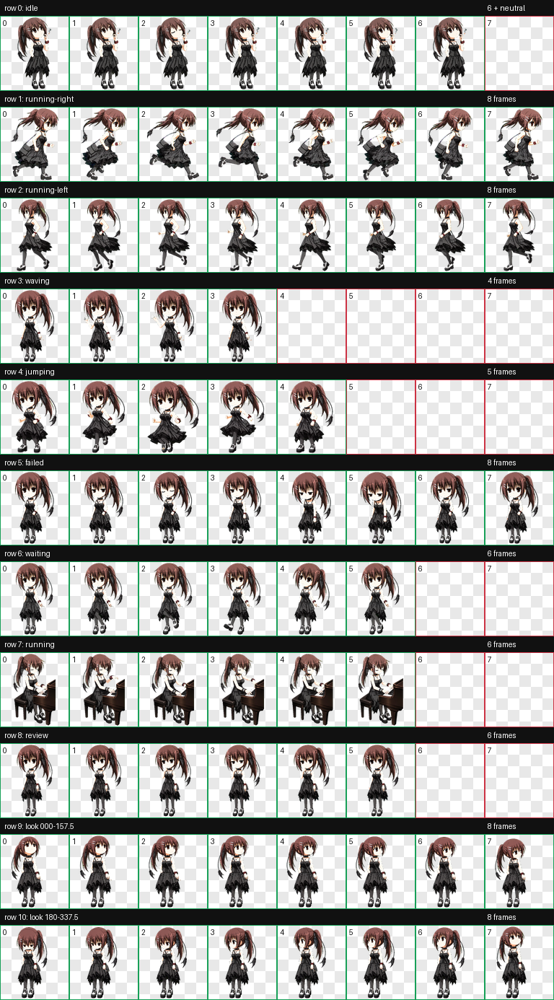
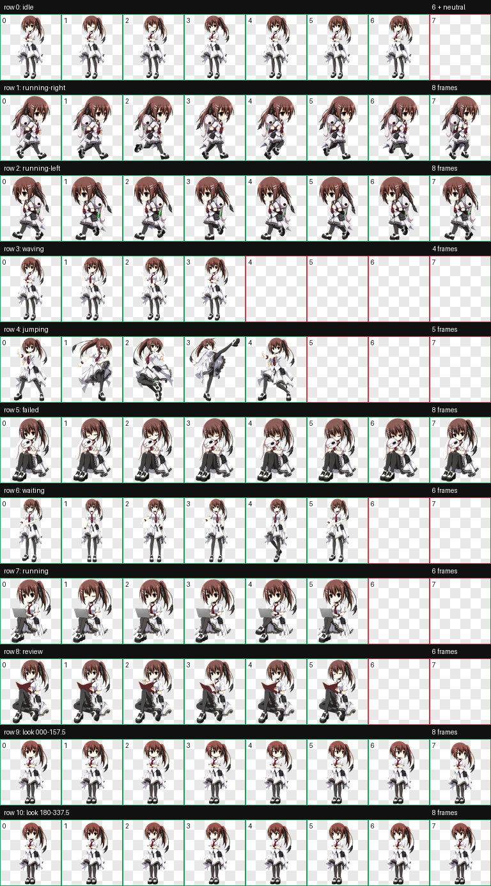

# 水上由岐 Codex 桌宠合集

水上由岐的两套 Codex 桌宠 v2：经典黑裙版与白裙版。两套版本均为非像素的高清日系 SD/Q 版风格，并包含 Codex v2 所需的 9 个标准动作状态和 16 向观察素材。

## 下载

| 版本 | Pet ID | 主要动作 | 安装包 |
|---|---|---|---|
| 经典黑裙版 | `minakami-yuki` | 仰望天空、抽烟、弹钢琴等 | [minakami-yuki-v2.codex-pet.zip](dist/minakami-yuki-v2.codex-pet.zip) |
| 白裙版 | `minakami-yuki-white` | 背娃娃哭泣移动、架势踢腿、抱娃娃、电脑思考、看书等 | [minakami-yuki-white-v2.codex-pet.zip](dist/minakami-yuki-white-v2.codex-pet.zip) |

每个压缩包只包含运行所需的 `pet.json` 与 `spritesheet.webp`。

## 安装

1. 下载并解压所需的 `.codex-pet.zip`。
2. 在 Codex 宠物目录中创建与 Pet ID 同名的文件夹：
   - Windows：`%USERPROFILE%\.codex\pets\minakami-yuki`
   - Windows 白裙版：`%USERPROFILE%\.codex\pets\minakami-yuki-white`
3. 将解压后的 `pet.json` 和 `spritesheet.webp` 放入对应文件夹。
4. 重启 Codex，或重新选择桌宠。

## 协议与验证

- `spriteVersionNumber: 2`
- 8 列 × 11 行
- 单格 192 × 208
- 图集 1536 × 2288
- RGBA WebP
- 9 个标准动作状态
- 16 个观察方向（22.5° 间隔）

两套图集都经过尺寸、透明度、动作格占用与方向语义验证。白裙版另附三份隔离方向盲测结果。

可使用仓库根目录的 [CHECKSUMS.sha256](CHECKSUMS.sha256) 校验运行文件和安装包。

当前 Windows 客户端不会由普通系统鼠标直接触发观察帧；16 向素材仍完整保留，以满足 v2 协议和受支持的内部触发路径。

## 预览

### 经典黑裙版



### 白裙版



每个版本目录还包含动作 GIF、方向图及验证报告。

## 目录结构

```text
dist/                             可直接安装的压缩包
pets/minakami-yuki/               黑裙版运行文件
pets/minakami-yuki-white/         白裙版运行文件
docs/minakami-yuki/               黑裙版预览
docs/minakami-yuki-white/         白裙版预览
```

## 声明

这是非官方、非商业的个人二次创作桌宠项目。角色及原作相关权利归各自权利人所有；仓库中的素材不授予商业使用、再销售或再授权许可。详见 [NOTICE.md](NOTICE.md)。
